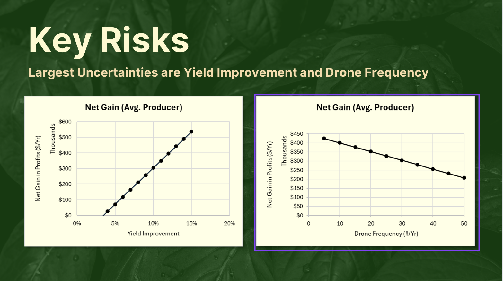

# AutoFarmer - EF Hackathon

Automated visual detection and analysis solution for farmers 


## :rocket: Demo
**1. Clone the repository** <br>
```bash
git clone https://github.com/essamsleiman/Auto-Farmer.git
cd Auto-Farmer
```

**2. Install Packages** <br>
```bash
npm i
```


**4. Download data** <br>
[Apple Ripeness Levels Image Dataset](https://www.kaggle.com/datasets/davidhilton/apple-ripeness-levels-image-dataset?resource=download)

**4. Run the demo** <br>

```bash
# Demo
npm run dev

```

# Presentation




